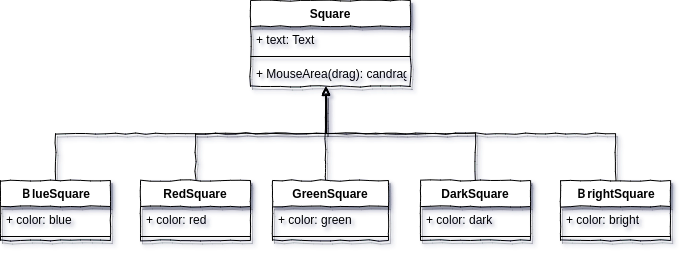

## Noob Note

* 格式化代码：`ctrl` + `i`

* `F1`查看定义

* `ctrl`+`鼠标左键`点击的函数在定义与实现中切换
* 运行程序时，`Tab`键切换焦点

  


## Qt QML GUI Programing



#### 

* [查找色块](https://www.w3.org/TR/css-color-3/#svg-color)


## Qt C++ GUI Programing

* `Widget` 中的信号与槽
  * 槽：处理函数，发送的信号，需要处理，处理的函数即为槽
  * 信号：只需声明，不需实现。moc会自动生成。


* `connect`两种写法：

```c++
connect(closeButton, SIGNAL(clicked()), this, SLOT(close()));
connect(closeButton, &QPushButton::clicked, this, &FindDialog::close);
//connect(信号的发送者，信号函数的地址，信号的接收者，槽的地址)；
```

* `Q_OBJECT`宏
  * 应该出现在类的私有定义中; 若该类自定义了信号和槽，则应该加上该宏


# Projects

* [XCalc](learn-Qt-CPP-GUI/XCalc) : A simple calculator
* [XSpreadsheet](learn-Qt-CPP-GUI/XSpreadsheet) : A simple Excel
* [XNotePad](learn-QtQuick/XNotePad) : A simple Editor

